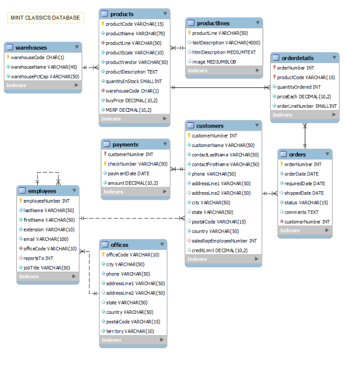
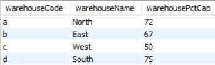
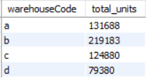
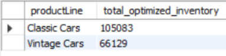
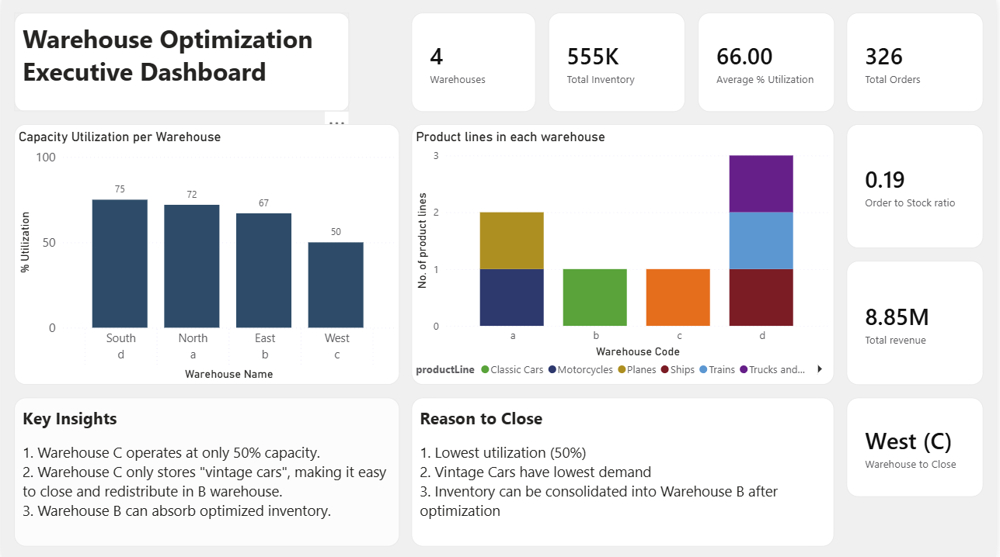
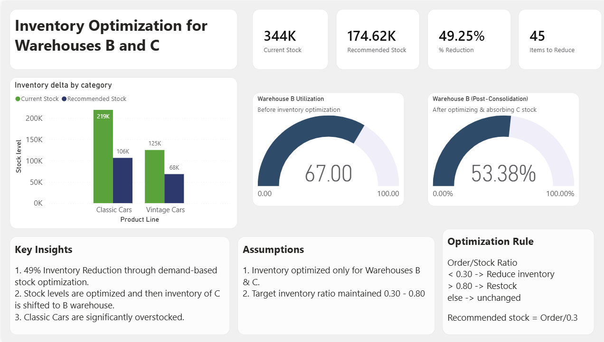
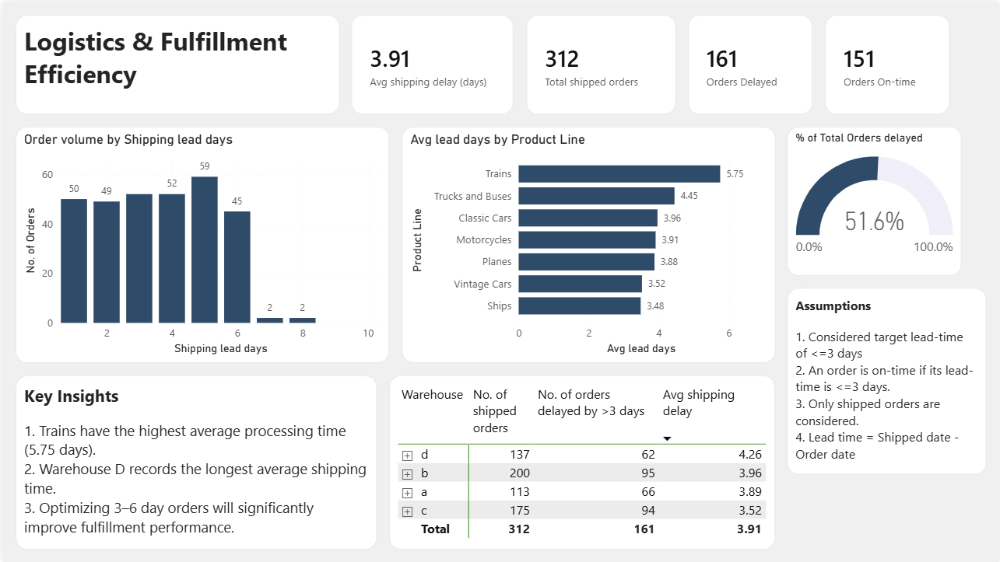

# 📦 Warehouse Optimization & Inventory Analysis


> **A data-driven warehouse consolidation project using SQL and Power BI to identify an underperforming warehouse, optimize inventory levels, and evaluate the impact on shipping performance.**

---

## 📌 Project Introduction

Mint Classics Company is considering whether it can **close one of its storage facilities without negatively affecting inventory availability or customer delivery performance**.

This project uses historical **inventory, product, warehouse, order, and shipping data** to answer three key business questions:

1. **Which warehouse should be considered for closure?**
2. **Can the remaining warehouse(s) absorb the inventory after optimization?**
3. **Will warehouse consolidation create shipping or fulfillment issues?**

I used **MySQL for data exploration and analysis** and **Power BI for interactive visualization and decision-making**.

The analysis ultimately identifies **Warehouse C (West)** as a closure candidate because it is only **50% utilized** and primarily stores **Vintage Cars**, a product line showing relatively low demand compared with its inventory levels.

---

## 🎯 Business Objectives

The project focuses on three objectives:

### 1. Warehouse Optimization

Evaluate warehouse capacity and identify underutilized facilities.

### 2. Inventory Optimization

Analyze inventory against historical order demand and identify products that are overstocked or understocked.

### 3. Operational Efficiency

Analyze shipping times and delayed orders to ensure consolidation does not negatively affect customer service.

---

## 🛠️ Tools & Technologies

| Tool                 | Purpose                                                     |
| -------------------- | ----------------------------------------------------------- |
| **MySQL**            | Data exploration, joins, aggregations and business analysis |
| **SQL**              | Inventory, warehouse and shipping analysis                  |
| **Power BI**         | Interactive dashboards and data visualization               |
| **DAX**              | Calculated measures and KPIs                                |
| **GitHub**           | Documentation and project sharing                           |
| **Coursera Dataset** | Source database                                             |

---

## 🗂️ Project Structure

```text
Warehouse-Optimization/
│
├── README.md
│
├── SQL/
│   ├── warehouse_analysis.sql
│
├── PowerBI/
│   └── warehouse_optimization.pbix
│
├── assets/
│
└── docs/
    └── detailed-analysis.md
```

---

# 🧩 Dataset & Scenario

The project is based on the **Mint Classics Company relational database**, containing information about:

* Products
* Product lines
* Warehouses
* Orders
* Order details
* Customers
* Employees

The original dataset/project is provided through Coursera:

🔗 [Coursera Project – Analyze Data in a Model Car Database](https://www.coursera.org/projects/showcase-analyze-data-model-car-database-mysql-workbench)

---

## 🗄️ Database Schema

The analysis uses relationships between products, warehouses and orders to connect:

```text
Warehouses
     │
     ▼
Products
     │
     ▼
Order Details
     │
     ▼
Orders
```

This allows inventory levels to be compared against actual historical demand and shipping performance.



---

# 🔍 Analysis Approach

The analysis was divided into three stages:

```text
Warehouse Capacity
        ↓
Inventory & Demand Analysis
        ↓
Inventory Optimization
        ↓
Shipping Performance
        ↓
Final Recommendation
```

---

# 🏭 Step 1 — Assess the Need to Close a Warehouse

## 1. Warehouse Capacity Analysis

The first step was to examine warehouse capacity.

```sql
SELECT *
FROM warehouses;
```

### 🔎 Finding

**Warehouse C (West)** operates at approximately **50% capacity**, making it significantly underutilized compared with the other facilities.



---

## 2. Check for Inventory Redundancy

Before closing a warehouse, it is important to understand whether products are duplicated across multiple locations.

```sql
SELECT 
    productCode,
    COUNT(DISTINCT warehouseCode) AS cnt
FROM products
GROUP BY productCode
HAVING cnt > 1;
```

### 🔎 Finding

No significant product redundancy was identified in the result.

Each product is stored in **one warehouse**, meaning closure would require inventory redistribution rather than simply removing duplicate stock.

---

## 3. Product Distribution by Warehouse

```sql
SELECT DISTINCT 
    productLine,
    warehouseCode
FROM products
ORDER BY warehouseCode;
```

### 🔎 Finding

The analysis shows a strong product-line concentration:

| Warehouse   | Primary Product Line |
| ----------- | -------------------- |
| Warehouse B | Classic Cars         |
| Warehouse C | Vintage Cars         |

This makes Warehouse C particularly important to investigate because its inventory is concentrated in a single product category.

---

# 📉 Step 2 — Analyze Inventory vs. Demand

Warehouse utilization alone is not enough to justify closure.

The next question was:

> **Is the inventory stored in Warehouse C actually supported by customer demand?**

To answer this, historical order quantities were compared with current inventory levels.

```sql
WITH t AS (
    SELECT 
        o.orderNumber,
        p.productName,
        p.productLine,
        o.quantityOrdered,
        p.quantityInStock,
        p.warehouseCode
    FROM orderdetails o
    JOIN products p
        ON o.productCode = p.productCode
)

SELECT 
    t.productName,
    t.productLine,
    SUM(t.quantityOrdered) AS total_ordered,
    MAX(t.quantityInStock) AS quantity_in_stock,
    SUM(t.quantityOrdered) / MAX(t.quantityInStock) AS order_stock_ratio
FROM t
JOIN products p
    ON t.productName = p.productName
GROUP BY 
    t.productName,
    t.productLine
ORDER BY order_stock_ratio DESC;
```

### 📊 Key Finding

The **Vintage Cars** product line generally shows a **low order-to-stock ratio**, indicating that inventory levels are relatively high compared with historical demand.

Most products have a ratio below **0.20**, while only a small number of products show ratios above 1.

### Business Interpretation

Low demand velocity + low warehouse utilization creates a strong operational case for investigating Warehouse C as a consolidation candidate.

---

# ✅ Warehouse Closure Recommendation

Based on the combined analysis:

### Warehouse C — West

* Approximately **50% utilized**
* Primarily stores **Vintage Cars**
* Vintage Cars generally show **low demand relative to inventory**
* Inventory can be reduced and redistributed
* Remaining inventory can be consolidated into Warehouse B after optimization

> **Recommendation:** Consider closing Warehouse C after reducing excess Vintage Cars inventory and validating the resulting logistics impact.

---

# 📦 Step 3 — Inventory Optimization

Closing a warehouse requires more than moving its inventory.

The next step was to determine **how much inventory should actually be retained**.

---

## Inventory Health Framework

I used the **order-to-stock ratio** as a simple inventory health indicator.

| Ratio         | Interpretation                           |
| ------------- | ---------------------------------------- |
| `< 0.30`      | Potential excess inventory               |
| `0.30 – 0.80` | Balanced range                           |
| `> 0.80`      | Potential stock-out / replenishment risk |

This framework was used to identify products requiring inventory reduction or replenishment.

---

## Identify Overstocked Products

```sql
WITH t AS (
    SELECT 
        o.orderNumber,
        p.productName,
        p.productLine,
        o.quantityOrdered,
        p.quantityInStock,
        p.warehouseCode
    FROM orderdetails o
    JOIN products p
        ON o.productCode = p.productCode
)

SELECT 
    t.productName,
    t.productLine,
    SUM(t.quantityOrdered) AS total_ordered,
    MAX(t.quantityInStock) AS quantity_in_stock,
    SUM(t.quantityOrdered) / MAX(t.quantityInStock) AS ratio
FROM t
JOIN products p
    ON t.productName = p.productName
WHERE t.productLine IN ('Vintage Cars', 'Classic Cars')
GROUP BY 
    t.productName,
    t.productLine
ORDER BY 
    t.productLine,
    ratio DESC;
```

### 🔎 Finding

Products with a ratio below **0.30** were identified as candidates for inventory reduction.

The analysis particularly highlighted excess stock within:

* Vintage Cars
* Selected Classic Cars

---

# 🧮 Step 4 — Calculate Optimized Inventory

To estimate the inventory requirement after optimization, target inventory levels were calculated using the demand ratio.

```sql
SELECT
    productName,
    productLine,
    warehouseCode,
    total_ordered,
    quantity_in_stock,
    ratio,

    CASE
        WHEN ratio < 0.30
            THEN ROUND(total_ordered / 0.30)

        WHEN ratio > 0.80
            THEN ROUND(total_ordered / 0.80)

        ELSE quantity_in_stock
    END AS updated_inventory

FROM temp_inventory_summary

WHERE productLine IN ('Classic Cars', 'Vintage Cars')

ORDER BY
    productLine,
    updated_inventory DESC;
```

### 📊 Target Inventory Logic

```text
Ratio < 0.30
      ↓
Reduce inventory

Ratio 0.30–0.80
      ↓
Maintain inventory

Ratio > 0.80
      ↓
Consider replenishment
```

---

## 📈 Optimization Result

After inventory adjustment:

> **Estimated consolidated inventory ≈ 174K units**

This represents approximately **53% of Warehouse B's capacity**.

Therefore, after reducing excess inventory, the remaining stock from the two warehouses can fit within Warehouse B's available capacity.



---

# 🚚 Step 5 — Shipping Performance Analysis

Warehouse consolidation should not be evaluated solely on storage costs.

The next question was:

> **Will closing Warehouse C negatively affect delivery performance?**

---

## 1. Analyze Shipping Delays

```sql
SELECT 
    diff,
    COUNT(diff)
FROM (
    SELECT 
        orderNumber,
        orderDate,
        shippedDate,
        IFNULL(
            DATEDIFF(shippedDate, orderDate),
            0
        ) AS diff
    FROM orders
) AS tt
GROUP BY diff
ORDER BY diff;
```

### 🔎 Finding

Orders taking approximately **3–6 days** represent an important area for operational improvement.

Reducing processing and fulfillment delays in this range could improve overall shipping consistency.

---

## 2. Average Shipping Time by Product Line

```sql
SELECT 
    p.productLine,
    ROUND(
        AVG(
            DATEDIFF(o.shippedDate, o.orderDate)
        ), 2
    ) AS avg_shipping_days

FROM orders o

JOIN orderdetails od
    ON o.orderNumber = od.orderNumber

JOIN products p
    ON od.productCode = p.productCode

WHERE o.shippedDate IS NOT NULL

GROUP BY p.productLine

ORDER BY avg_shipping_days;
```

### 🔎 Finding

The analysis showed differences in shipping performance across product lines:

* **Ships** → among the fastest
* **Trains** → among the slowest

This highlights the need to evaluate operational bottlenecks separately from warehouse capacity.

---

## 3. Products Associated with Frequent Delays

```sql
SELECT 
    p.productName,
    p.productLine,
    COUNT(*) AS delayed_orders,
    SUM(od.quantityOrdered) AS ordered,
    MAX(p.quantityInStock) AS inStock,
    p.warehouseCode

FROM orders o

JOIN orderdetails od
    ON o.orderNumber = od.orderNumber

JOIN products p
    ON od.productCode = p.productCode

WHERE DATEDIFF(o.shippedDate, o.orderDate) > 3

GROUP BY
    p.productName,
    p.productLine,
    p.warehouseCode

ORDER BY delayed_orders DESC;
```

### 🔎 Finding

Frequent delays were particularly visible in products associated with **Warehouse A**, including products from the Planes and Motorcycles categories.

This suggests that shipping-process optimization should accompany warehouse consolidation.

---

# 📊 Power BI Dashboard

To complement the SQL analysis, I created an interactive **Power BI dashboard** for decision-makers.

The dashboard converts the SQL findings into visual KPIs and actionable insights.

---

## Dashboard Includes

### 📍 Executive Overview

* Total warehouses
* Warehouse utilization
* Recommended warehouse for closure
* Inventory before vs. after optimization
* Inventory reduction opportunities
* Products requiring restocking
* Capacity utilization

### 📦 Inventory Optimization

* Current vs. recommended inventory
* Overstocked products
* Products requiring replenishment
* Order-to-stock ratio
* Product-line demand patterns

### 🏭 Warehouse Analysis

* Inventory by warehouse
* Capacity utilization
* Warehouse-to-product-line distribution
* Inventory concentration

### 🚚 Shipping Performance

* Average shipping time
* Delayed orders
* Shipping performance by product line
* Products associated with frequent delays







---

# 📌 Key Insights

| Area                            | Key Finding                                                               |
| ------------------------------- | ------------------------------------------------------------------------- |
| **Warehouse Utilization**       | Warehouse C operates at approximately 50% capacity                        |
| **Inventory Distribution**      | Warehouse C is primarily associated with Vintage Cars                     |
| **Demand vs Stock**             | Vintage Cars generally have low order-to-stock ratios                     |
| **Inventory Optimization**      | Excess stock can be reduced using demand-based thresholds                 |
| **Post-Optimization Inventory** | Estimated consolidated inventory ≈ 174K units                             |
| **Warehouse B Capacity**        | Optimized inventory can fit within Warehouse B                            |
| **Shipping Delays**             | 3–6 day processing delays represent an improvement opportunity            |
| **Shipping Performance**        | Shipping time varies across product lines                                 |
| **Operational Bottleneck**      | Frequent delays were concentrated in products associated with Warehouse A |

---

# 💡 Final Recommendations

## 1. Consider Closing Warehouse C

Warehouse C is approximately **50% utilized**, while the majority of its inventory belongs to the relatively slow-moving Vintage Cars category.

This makes it a logical candidate for consolidation.

---

## 2. Reduce Excess Inventory Before Consolidation

Do not simply transfer all inventory from Warehouse C.

Instead:

```text
Identify excess stock
        ↓
Reduce low-demand inventory
        ↓
Redistribute required inventory
        ↓
Consolidate into Warehouse B
```

This minimizes the amount of physical inventory that needs to be relocated.

---

## 3. Maintain Inventory Using Demand-Based Thresholds

Use historical demand to continuously identify:

* Overstocked products
* Replenishment requirements
* Slow-moving inventory
* Inventory concentration

This creates a more data-driven inventory management process.

---

## 4. Monitor Shipping Performance

Warehouse consolidation should be accompanied by shipping KPIs such as:

* Average shipping days
* Delayed orders
* Order processing time
* Product-line shipping performance
* Warehouse-level lead time

This ensures that cost savings do not come at the expense of customer experience.

---

# 🧠 Business Impact

The analysis demonstrates how relatively simple operational data can support a larger business decision.

### Instead of asking:

> **“Which warehouse has available space?”**

The analysis asks:

> **“Which warehouse contributes the least operational value relative to its cost and inventory requirements?”**

By combining:

**Warehouse Capacity + Inventory Demand + Inventory Optimization + Shipping Performance**

the project moves from basic SQL analysis to a **data-driven operational recommendation**.

---

# 📚 Skills Demonstrated

### Technical

`SQL` `MySQL` `Power BI` `DAX` `Data Analysis` `Data Visualization`

### Analytics

`Inventory Analysis` `Warehouse Optimization` `Demand Analysis` `KPI Design` `Operational Analytics` `Business Intelligence`

### Business

`Cost Reduction` `Capacity Planning` `Inventory Optimization` `Decision Support` `Supply Chain Analysis`

---

# ⚠️ Limitations & Assumptions

This analysis is based on historical data and should be treated as a **decision-support analysis rather than a guaranteed operational outcome**.

Key assumptions include:

* Historical order demand is representative of future demand.
* The selected order-to-stock thresholds are analytical benchmarks rather than company-defined policies.
* Warehouse capacity calculations assume that available capacity can be practically reorganized.
* Shipping performance may be affected by factors beyond warehouse location.
* Actual closure decisions should also consider fixed costs, transportation costs, labor, facility contracts and customer geography.

---

# 🔗 Project Resources

**Original Coursera Project:**
[Analyze Data in a Model Car Database – Coursera](https://www.coursera.org/projects/showcase-analyze-data-model-car-database-mysql-workbench)

**Detailed Analysis:**
[Google Docs – Detailed Project Analysis](https://docs.google.com/document/d/1Bc6u-P9brIQcbDQxHh-i1FPdWDVFv0Qd7Apdo7xDG8c/edit?usp=sharing)

---

# 👨‍💻 Author

**Atharvan Pohnerkar**

Data Analytics | Product Analytics | SQL | Power BI

---

> **⭐ If you found this project useful, feel free to explore the SQL analysis and Power BI dashboard in the repository.**
